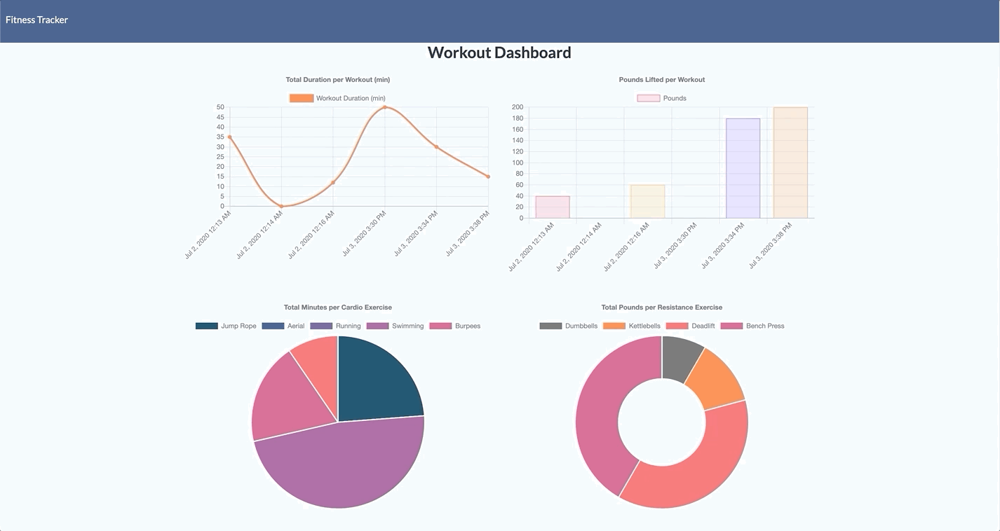

# Workout Tracker: MongoDB & Mongoose (NoSQL)

[Mongo Workout](https://mongoworkout.herokuapp.com/) is a fitness tracker that tracks resistance and cardio exercises that make up your daily workout. Each workout and exercise is then visualized in a dashboard using [Chart.js](https://www.chartjs.org/).

Mongo Workout is a full-stack web application that utilizes the following technologies:

* **Back-end:** MongoDB, Mongoose, Express, and NodeJS
* **Front-end:** Semantic UI, Chart.js, and Moment.js

The application is deployed to Heroku with a MongoDB backend here: [mongoworkout.herokuapp.com](https://mongoworkout.herokuapp.com/)

For this assignment, we were tasked with creating a workout tracker based on the user stories & acceptance criteria below. We were also provided source files for the front-end (committed as the [first commit](https://github.com/connietran-dev/mongo-workout/commit/fe318a54465683cc36ac9a46db731842f9ef3be8)). The assignment required us to create a Mongo database with a Mongoose schema and to handle routes with Express on the back-end.

For this assignment, I have highly customized the source files, as described below under [Code Improvements](#Code-Improvements).

# App Functionality

## Landing Page: Workout Summary

When you first come to the app (via `"/" route`), the app utilizes [workout.js](https://github.com/connietran-dev/mongo-workout/blob/main/public/assets/js/workout.js) to check if a workout already exists. This file calls `fetch("/api/workouts")` which is an `app.get` Express route in [`api-routes.js`](https://github.com/connietran-dev/mongo-workout/blob/main/routes/api-routes.js). This GET uses Mongoose to query the MongoDB and returns all workouts.

If no workouts are returned, then the landing page displays a prompt to the user to create a new workout. Otherwise, if workouts are returned, then the last workout is displayed with details about the workout itself (date, duration) and about the exercises that make up the workout (weight, sets, reps, distance).

You can then either continue your previous workout with Continue Workout or start a new workout with New Workout.

## Adding an Exercise with Mongoose

On the `/exercise` page, you are able to add either a resistance or cardio exercise to your workout. When this exercise is added, [exercise.js](https://github.com/connietran-dev/mongo-workout/blob/main/public/assets/js/exercise.js) ultimately POSTs the exercise to the `app.post(/api/workouts)` Express route in [`api-routes.js`](https://github.com/connietran-dev/mongo-workout/blob/main/routes/api-routes.js). 

This route uses the Mongoose method `.create` to create an exercise and add it to the corresponding Workout document in the `Workout` collection defined with Mongoose Model in [`models/`](https://github.com/connietran-dev/mongo-workout/tree/main/models).

## Displaying Data with Chart.js

Finally, you can click on [Dashboard](https://mongoworkout.herokuapp.com/stats) to view charts which visualize the workout and exercise data. The [`stats.js`](https://github.com/connietran-dev/mongo-workout/blob/main/public/assets/js/stats.js) file utilizes Mongoose to retrieve Workout and Exercise data from the MongoDB and Chart.js to generate the charts.

## User Stories

As a user: 

* I want to be able to view create and track daily workouts. 
* I want to be able to log multiple exercises in a workout on a given day. 
* I should also be able to track the name, type, weight, sets, reps, and duration of exercise. If the exercise is a cardio exercise, I should be able to track my distance traveled.

## Acceptance Criteria

When the user loads the page, they should be given the option to create a new workout (New Workout), or continue with their last workout (Continue Workout).

The user should then be able to:

  * Add exercises to a previous workout plan. (Continue Workout)
  * Add new exercises to a new workout plan. (New Workout)
  * View the combined weight of multiple exercises on the `stats` page. ([Dashboard](https://mongoworkout.herokuapp.com/stats))

# Code Improvements

The source files provided (committed as the [first commit](https://github.com/connietran-dev/mongo-workout/commit/fe318a54465683cc36ac9a46db731842f9ef3be8)) gave some direction on how to build the workout tracker with the MongoDB and Mongoose backend. From there, I have made the following changes. 

## Dashboard Charts

For the charts on the [Dashboard](https://mongoworkout.herokuapp.com/stats) ([stats.js](https://github.com/connietran-dev/mongo-workout/blob/main/public/assets/js/stats.js)), I tried to create charts based on the chart titles and labels that were provided in the [source code](https://github.com/connietran-dev/mongo-workout/commit/fe318a54465683cc36ac9a46db731842f9ef3be8):

Original => Final

* Workout Duration In Minutes => **Total Duration per Workout (min)**
* Pounds Lifted => **Pounds Lifted per Workout**
* Exercises Performed (data: durations) => **Total Minutes per Cardio Exercise**
* Exercises Performed (data: pounds) => **Total Pounds per Resistance Exercise**

In order to do so, I had to get more specific about the data that was returned from Mongoose/MongoDB for each chart.

Based off the titles and labels in the source code, the first two charts were asking for data per **workout**. The first chart was labelled "Workout Duration in Minutes". However, it used the `duration()` function which returned the duration for each **exercise**. It also hard-coded Sunday through Saturday on the x-axis. 

The code for the second chart was doing something similar and was utilizing pounds and also hard-coded days of the week.

Thus, I have made the x-axis dynamic based on the date of workouts. I also included the time for these workouts because I figured you may have multiple workouts in one day. I also made sure the calculations summarize the data for each total workout, not per exercise. The new functions also make it so that the data calculated for the y-axis matches up with the x-axis. (So, resistance exercise name #1 matches its duration). If time permits deeper exploration of the technology, there may be a more sophisticated way to retrieve the data needed for Chart.js .

The last two pie/donut charts were labeled for "Exercises Performed". They both utilized the same `workoutNames`, whether it was cardio or exercise. But some items in the legend were crossed out (i.e., hidden per Chart.js), because the item in the chart didn't apply to the exercise, for example, pounds didn't apply to cardio exercises.

Thus, I created separate charts for Cardio vs. Resistance Exercises Performed.

You may have also noticed that I went a little crazy with the comments and console.log for stats.js - The exercises for each Workout are nested in an array in that Workout. Thus, the `.forEach` loops on the array of Workouts to extract the data needed for each chart are nuanced. Hopefully, the comments help make it clear exactly what data is isolated for calculation, then what is pushed onto an array to be returned for the charts. They either use summary data about the workouts or data about individual exercises. I learned that it matters at which point the item is pushed onto the array for these functions! 

Although it was a bit strenuous to customize the stats page in this way, I found this was a good exercise in how to use Chart.js, and I learned a lot about how to utilize this cool technology. (HTML charts generated with JS? Pretty cool.)

## Other Changes

* Instead of using a separate `/api/workouts/range` call in stats.js to get all workout data from the back-end, I simplified and used the same `app.get` route to fetch all workout data. I then manipulated and transformed the data for the charts on the client-side.

* I'll be honest, combing through the source code was a bit tough. I organized the code, putting some public/ files into an assets/ folder and moved functions around so they follow the flow of the user experience. I also commented the code quite a bit - this was an educational tool for me. I imagine I will have to sort out other developers' code base in the future and comments & logging help immensely. I do hope to use a linter in the future to remove comments and logs from production code.

* I commented out some of the seeds in `seed.js` to create fewer records. This helps reduce noise in order to see actual records created from the app.

* I have renamed my master branch to `main` in support of a more inclusive term and in opposition of racially insensitive programming terminology. I had help changing mine with thanks to [Scott Hanselman](https://www.hanselman.com/blog/EasilyRenameYourGitDefaultBranchFromMasterToMain.aspx). You can read more on GitHub's changes [here](https://gizmodo.com/github-to-remove-master-and-slave-coding-terms-widely-s-1844041329).

## Insights

* As always, I tried to give the source code some custom styling. However, this was my first time really working with Semantic UI rather than Bootstrap. There are some more advanced things you can do with variables to customize the default Semantic styling. If time permits, I'd like to dive deeper into it.

* For a while, I could not get my basic GET route to work and return the workouts needed for the landing page and exercise page. I realized that the `"*"` route I had written in my `html-routes.js` was interfering with my GET route. So, I moved `api-routes.js` above my `html-routes.js` in the `server.js` to make sure the routes match on my GET and POST routes first :) 

# Future Enhancements

If time permits, there are additional improvements that could be made to the code. Below are ideas I was tracking while developing this app that I marked as "nice-to-have" and some of them I even had time to cross off the list!

- [ X ]  Set custom height for y-axis with Chart.js

- [ X ]  Change Dashboard page to Semantic UI instead of Bootstrap to be consistent with the other pages

- [ X ]  Reorganize source code to correspond with UI functionality

- [ X ]  Customize and ensure charts display correct Workout vs. Exercise data

- [ ]  Refactor the code to utilize separate `Exercise` and `Workout` Mongoose models: 

  - This would be a great exercise in utilizing Mongoose's `.populate` model to "join" and return two collections
  - I would then also refactor the [`seeds.js`](https://github.com/connietran-dev/mongo-workout/blob/main/seeders/seed.js) accordingly. The original seed files hint at the Mongoose schema I have currently implemented

- [ ]  Refactor a unique schema for cardio vs. resistance exercises: 

  - It would also be great to have a unique schema for cardio exercises and a unique schema for resistance exercises. Currently, the Mongoose [Workout Model](https://github.com/connietran-dev/mongo-workout/blob/main/models/Workout.js) simply groups all fields for both cardio and resistance exercises together

- [ ]  Put in validations on Mongoose Model

- [ ]  Refactor functions to async functions

- [ ]  Fix error messages for deprecated methods: There are some methods that have been deprecated. I would love to replace them with more modern functions